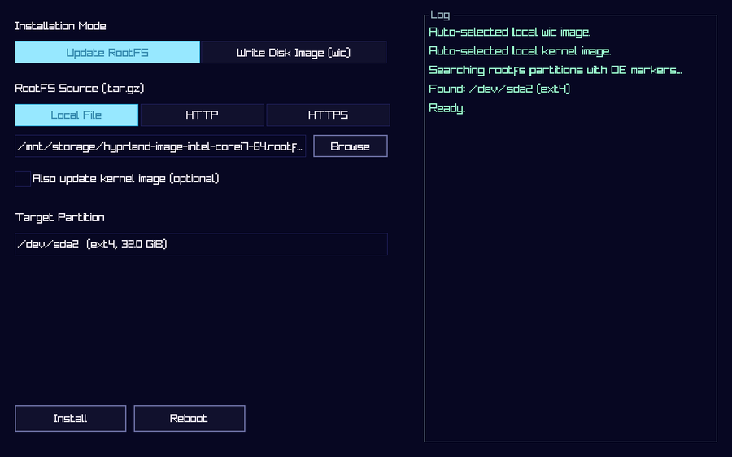

# meta-installer-raylib

A USB installer for OpenEmbedded/Yocto systems: updates a rootfs
partition or writes a full disk image (`.wic`), controlled by a
small GUI built on [raylib](https://www.raylib.com/)/[raygui](https://github.com/raysan5/raygui)
instead of a display manager or desktop environment. Fully usable
with keyboard alone (Tab + Enter reaches and activates everything,
mouse optional) as well as touch/mouse.



*Placeholder reconstructed from the layer's own theme/layout code,
not yet a real capture. To take one on actual hardware: set
`debug_mode = true` in `config.toml`, then press F12 in the running
app — a PNG lands in `/mnt/storage` (if writable) or `/tmp`, path
shown in the log.*

## Dependencies

Only [openembedded-core](https://git.openembedded.org/openembedded-core)
is required. No other layer is needed by default.

openembedded-core itself only carries the `qemu*` machines, so this
layer brings its own two generic machine definitions, modeled on
[meta-yocto-bsp](https://github.com/yoctoproject/meta-yocto)'s (X server
bits left out, everything here renders via DRM):

- **`genericx86-64`** — 64-bit x86 PCs booting via EFI (`core2-64`
  tune, so it also runs on older CPUs). Recommends the `i915`, `igc`
  and `r8152` kernel modules plus the `r8169` firmware, and auto-loads
  `i915`/`iwlwifi` at boot, the same set `meta-intel` would pick for
  this hardware class. Its kernel uses the `intel-corei7-64` BSP
  description from linux-yocto's own kernel-cache — the one
  `meta-intel` maps its x86-64 machines to, and the one this project
  had already been tested with on AMD and Intel hardware — rather than
  meta-yocto-bsp's slimmer `common-pc-64`: the first `common-pc-64`
  boot lost WiFi, USB mouse and ~30 s of boot time on the Intel test
  desktop (see `recipes-kernel/linux/linux-yocto_6.18.bbappend`).
- **`genericarm64`** — SystemReady IR/ES Arm64 platforms with working
  EFI firmware. Like the meta-yocto-bsp original it installs all kernel
  modules and boots the disk-backed image through
  `core-image-initramfs-boot`, since storage/USB drivers are modules on
  this machine class (`installer.wks.in` adds the initrd to the loader
  entry automatically whenever `INITRAMFS_IMAGE` is set). The
  `genericarm64` kernel lives on its own linux-yocto branch; its
  `SRCREV` in `recipes-kernel/linux/linux-yocto_6.18.bbappend` has to be
  refreshed from meta-yocto-bsp on every kernel bump. Not yet tested on
  real Arm64 hardware, and the helper scripts under `scripts/` as well
  as `kernel_target_name` in `config.toml` still assume an x86
  `bzImage` rather than an Arm64 `Image`.

Any other BSP layer works too — `meta-intel`'s `intel-corei7-64` is
what this layer was developed with before it grew its own machines.
Only `intel-microcode` is lost by dropping `meta-intel`; nothing in
the installer depends on it. If a BSP layer of your own ships machines
of the same names, its `conf/machine/` directory wins or loses purely
by `BBPATH` order, so avoid having both in `bblayers.conf`.

The `meta-oe` layer, from
[meta-openembedded](https://github.com/openembedded/meta-openembedded)
(for `iwd`), is only needed if WiFi support is turned on — see below.

## Graphics: DRM, no X11/Wayland, software rendering by default

The installer runs directly over `PLATFORM_DRM`, with no display
server involved at all. Rendering is pure software by default, so the
only runtime graphics dependency is `libdrm` — no Mesa, no EGL, no
GLES.

Hardware-accelerated GLES2 rendering can be turned on instead by
adding `opengl` to `DISTRO_FEATURES`:

```
DISTRO_FEATURES:append = " opengl"
```

Intel GPUs: it depends on the generation, even for pure software
rendering. Integrated GPUs up to Alder Lake bring up their display
without any i915 blobs (GuC is optional there and the framebuffer
lives in system memory). Discrete Arc cards (DG2) do **not**: GuC
submission is mandatory on DG2, without `dg2_guc_70.bin` the kernel
declares the GPU "wedged" and `drmModeSetCrtc()` fails with `-5`
(EIO) — confirmed on the Intel test desktop with an Arc card. The
`meta-intel` BSP would recommend the whole `linux-firmware-i915`
umbrella (~27 MB of GuC/HuC/DMC blobs for every generation);
`conf/distro/installer-minimal-raylib.conf` deliberately blocks that
via `BAD_RECOMMENDATIONS` and this layer instead ships its own
trimmed `linux-firmware-i915-dg2` package (~400 KB, GuC + DMC only,
see `recipes-kernel/linux-firmware/linux-firmware_%.bbappend`). For
a different Intel generation that turns out to need firmware, add
the blobs the kernel log asks for the same way rather than
unblocking the umbrella.

AMD GPUs need matching firmware even in software-rendering mode:
`amdgpu` requires it for basic display init/modesetting itself, not
just for accelerated rendering. This image currently ships
`linux-firmware-amdgpu-rembrandt` (`recipes-core/images/core-image-
installer-raylib.bb`) — picked for testing on the hardware available
at the time, not a universal default. Swap it for whichever
`linux-firmware-amdgpu-<codename>` package matches your own AMD GPU's
generation if the display doesn't come up correctly.

## WiFi

Off by default (uses `iwd`, requires meta-openembedded, see above).
Turn it on the same way:

```
DISTRO_FEATURES:append = " wifi"
```

When enabled, the app gains a small built-in WiFi client (scan,
connect, password entry) — no separate network manager or client
needed. Driver + firmware are only wired up for **exactly two
confirmed-working devices** out of the box: an Intel AX200 (via the
generic `iwlwifi` driver, firmware from this layer's own trimmed
`linux-firmware-iwlwifi-cc` package, split out of oe-core's linux-firmware
in `recipes-kernel/linux-firmware/linux-firmware_%.bbappend`) and a
Realtek RTW89-family card
(RTL8852BE specifically, via `CONFIG_RTW89_8852BE` in
`recipes-kernel/linux/files/wifi-enable.cfg`, firmware from oe-core's
own `linux-firmware-rtl8852`). Both drivers are enabled by this layer's
own kernel fragment (`wifi-enable.cfg`: `CONFIG_IWLWIFI`/`CONFIG_IWLMVM`
and `CONFIG_RTW89_8852BE`), so they don't depend on what a BSP kernel
happens to configure. The same fragment also builds the kernel's
userspace crypto API in (`CONFIG_CRYPTO_USER_API_HASH`/`_SKCIPHER`,
i.e. AF_ALG sockets): iwd probes it at startup and refuses to run
without it, and as modules those would never reach the image, since
the distro deliberately blocks the `kernel-modules` umbrella package. Any other card — including a *different* RTW89
variant — needs its own kernel config addition (driver) and, if not
already pulled in, its own `linux-firmware-*` package.

## Two images

- **`core-image-installer-raylib`** — disk-backed installer image,
  intended to boot **from a USB stick**. On first boot,
  `storage-partition-helper` creates an extra partition in the
  stick's own unused space, giving the installer somewhere to hold a
  large local `rootfs.tar.gz`/`.wic` file if one is copied there
  after booting (no payload baked in — download over HTTP/HTTPS
  works either way and doesn't need this at all). It only does so
  when at least **32 GiB** of unpartitioned space follow the image
  (`MIN_MIB` in the script); on a 32 GB stick (~29.8 GiB usable)
  nothing is created and the helper just logs "skipping".
  `scripts/build-payload-image.sh` covers the opposite case: it
  bundles a payload directly onto the same stick at build time, so
  it's already there on first boot, with nothing to fetch or copy
  afterwards. See the script's own comments for usage.
- **`core-image-installer-raylib-initramfs`** — the same installer as
  a pure initramfs, no disk-backed rootfs partition of its own at
  all. Primarily intended to be **embedded onto an existing, real
  machine's own boot disk** as an extra `systemd-boot` menu entry
  (see `scripts/add-initramfs-installer-boot-entry.sh` /
  `embed-initramfs-installer-live.sh` below) — a rescue/recovery
  option that's always there, without a USB stick to keep track of.
  Standalone USB booting also works (`build-initramfs-installer-
  image.sh`). On boot it reads the `LoaderDevicePartUUID` EFI
  variable to find a partition labeled `home` **on the disk it was
  booted from** and mounts it **read-only** at `/mnt/storage` (a
  rescue tool has no business writing to a system's own data
  partition), so files there stay available even though the installer
  itself runs entirely from RAM. That deliberately only applies to
  the embedded case: booted standalone from a USB stick, the "boot
  disk" is the stick, and the machine's internal home partition is
  left alone. `usb-automount` is included too, same as the disk-backed
  image, for reading a payload off an inserted USB stick instead - and
  since the standalone stick's own ESP is a USB partition as well, it
  gets mounted at `/mnt/usb-<device>` too, so payload files dropped
  next to the kernel on that stick are picked up automatically.

Inserted USB sticks are mounted read-only at `/mnt/usb-<device>`
(e.g. `/mnt/usb-sda1`) on both images, and the first mounted
partition is additionally reachable via a stable `/mnt/usb` symlink
— a predictable path to type or script against, since sticks usually
carry a single partition. The file browser picks these up
automatically.

## Scripts

Helper tools under `scripts/`, not part of either image at runtime -
most run on the build machine, one runs directly on a deployed target
(noted below):

- **`build-payload-image.sh`** — bundles a payload onto the
  disk-backed installer image, see above.
- **`add-initramfs-installer-boot-entry.sh`** — embeds the initramfs
  installer onto an existing desktop image's own disk as an extra
  `systemd-boot` menu entry - just two extra files (kernel +
  initramfs) and a loader entry, no partition work at all.
- **`build-initramfs-installer-image.sh`** — builds a standalone,
  ESP-only bootable image for the initramfs installer.
- **`embed-initramfs-installer-live.sh`** — same idea as
  `add-initramfs-installer-boot-entry.sh`, but **run directly on an
  already-deployed, already-running target itself** (as root)
  instead of a build artifact.
- **`serve-https.py`** — a small local HTTP/HTTPS server for testing
  the app's own URL-based download options without a real server.

The three initramfs scripts auto-detect kernel and initramfs from
`tmp/deploy/images/*/` relative to the current directory when `-k`/`-i`
are not given. With more than one machine directory present (e.g.
after switching `MACHINE` in `local.conf`, the old one's artifacts
still around) the **newest** match by mtime wins; export `MACHINE` to
pin a specific one. The scripts print what they picked - check that
line when a freshly built change does not seem to show up on the
target.

## Status

Actively developed, tested on real AMD and Intel hardware. See the
comments in the code itself for the reasoning behind non-obvious
decisions.
